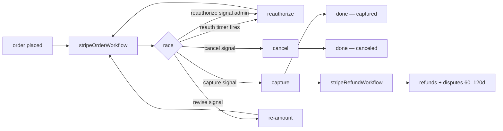

# temporal-stripe

> Temporal workflows for the Stripe Connect lifecycle that almost everyone hand-rolls and gets wrong: reauthorization before auth expiry, multi-capture, partial refunds, order revisions, refunds + disputes, and the webhook gymnastics that come with them.

[](./LICENSE)
[](#status)
[](#requirements)
[](#requirements)

```
npm i @temporal-stripe/core
npm i @temporal-stripe/webhook   # tiny, no Temporal dep
```

| Package | What it does |
|---|---|
| [`@temporal-stripe/core`](./packages/core) | Workflows + activities + signals for the PaymentIntent lifecycle (reauth, capture, multicapture, refund, dispute, revise) |
| [`@temporal-stripe/webhook`](./packages/webhook) | Tiny helpers to filter our own reauth-initiated `payment_intent.canceled` events |

## Contents

- [The problem](#the-problem)
- [What you get](#what-you-get)
- [Signals](#signals)
- [Refund + dispute workflow](#refund--dispute-workflow)
- [Activity contract](#activity-contract)
- [Saga primitive](#saga-primitive)
- [Per-issuer expiry overrides](#per-issuer-expiry-overrides)
- [Quick start](#quick-start)
- [Status](#status)
- [Changelog](#changelog)
- [Contributing](#contributing)

---

## The problem

Stripe expires manual-capture PaymentIntents:

| Brand | Default expiry |
|---|---|
| Visa | **5 days** |
| Mastercard, Amex, others | **7 days** |
| With `request_extended_authorization: true` and issuer-approved | up to 30 days (`capture_before` field) |

If you ship physical goods, run a fraud hold, schedule delivery, or have any process longer than a few hours between auth and capture — **the auth will expire on you in production**. The fix is "reauthorization": tag the old PI, cancel it, create a new one against the saved payment method, keep going.

That sounds like six lines of code. It's six lines of code and twelve edge cases.

<details>
<summary><b>Why the naive reauth is wrong</b> — six edge cases nobody documents</summary>

- The original PI must've been created with `setup_future_usage: 'off_session'` for the payment method to be reusable.
- Cancelling fires `payment_intent.canceled` — your "order canceled" handler will fire on *your own reauth* unless you tag and filter it.
- The new PI's expiry timer needs to be recomputed from the new charge's `capture_before` and card brand (which can change if the payment method is updated).
- Revisions (drop the order total) re-amount the PI — same reauth flow, different trigger.
- Partial captures with Connect get tangled with application fees (intermediate slice vs final-capture release).
- Admin "reauth this now" overrides have to coexist with the timer without racing.
- And the timer itself has to survive worker restarts.

Temporal solves the "survive restarts" part. This library solves the rest.

</details>

---

## What you get

A single `stripeOrderWorkflow` that owns one PaymentIntent end-to-end, with a small set of signals and a clean activity interface:



The library never assumes a DB schema. You provide `persistContext(ctx)` and the lifecycle hooks (`onReauthorized`, `onCaptured`, `onCanceled`, `onFailure`); the workflow calls them at the right moments.

---

## Signals

<details>
<summary><b>stripeOrderWorkflow</b> — capture, multicapture, cancel, reauthorize, revise</summary>

| Signal | Payload | What it does |
|---|---|---|
| `capture` | `{ amountToCaptureCents?, applicationFeeCents? }` | Capture (full or partial). Terminal. |
| `multicapture` | `{ amountCents, isFinal?, applicationFeeCents? }` | Capture a slice against the PI. `isFinal: true` releases any remaining hold via `paymentIntents.capture(final_capture)` and terminates the workflow. Intermediate slices loop. |
| `cancel` | `{ reason: 'customer' \| 'admin' \| 'fraud' \| 'timeout' \| 'unrecoverable_error', notes? }` | Cancel the PI. Terminal. |
| `reauthorize` | — | Force an immediate reauth, bypassing the timer. Loops. |
| `revise` | `{ newAmountCents, reason? }` | Drop the PI to a smaller amount via tag-cancel-recreate. Loops. Increases are rejected. |

If multiple signals are pending in the same workflow tick, priority is **cancel > revise > admin reauth > multicapture > capture**. That way a "drop the price *then* capture" sequence sent in quick succession lands at the new amount.

</details>

## Refund + dispute workflow

<details>
<summary><b>stripeRefundWorkflow</b> — refunds + disputes (60–120 day window)</summary>

Run `stripeRefundWorkflow` per captured PI for the long-tail refund and chargeback path. Lives separately so the order workflow can terminate cleanly at capture while this one keeps listening through the chargeback window.

| Signal | Payload | What it does |
|---|---|---|
| `refundRequest` | `{ amountCents?, reason?, notes?, reverseTransfer?, refundApplicationFee? }` | Issue a refund. Omit `amountCents` to refund the remaining balance. Accumulates across multiple signals. |
| `disputeOpened` | `{ disputeId, amountCents, reason? }` | A Stripe dispute landed. Workflow flips to `disputed`; further refund signals are short-circuited (Stripe rejects them anyway). |
| `disputeClosed` | `{ disputeId, status }` | Dispute resolved (won / lost / warning_closed). Workflow flips to `dispute_closed` and is eligible to take more refunds again. |

</details>

## Activity contract

<details>
<summary><b>Activity interfaces</b> — the surface you implement (or let the helper implement for you)</summary>

```ts
interface StripeOrderActivities {
  reauthorizePayment(input): Promise<{ newPaymentIntentId; authCreatedAt; captureBefore; cardBrand }>;
  tagAndCancelOldPaymentIntent(input): Promise<void>;
  createReauthorizedPaymentIntent(input): Promise<{ newPaymentIntentId; authCreatedAt; captureBefore; cardBrand }>;
  capturePaymentIntent(input): Promise<{ chargeId; amountCapturedCents }>;
  cancelPaymentIntent(input): Promise<void>;
  revisePaymentIntent(input): Promise<{ newPaymentIntentId; authCreatedAt; captureBefore; cardBrand }>;
  refundPaymentIntent(input): Promise<{ refundId; amountCents }>;
  persistContext(ctx): Promise<void>;
  onCaptured(ctx, charge): Promise<void>;
  onCanceled(ctx, reason): Promise<void>;
  onReauthorized(ctx, pi): Promise<void>;
  onFailure(ctx, err): Promise<void>;
}

interface StripeRefundActivities {
  refundPaymentIntent(input): Promise<{ refundId; amountCents; status? }>;
  persistRefundContext(ctx): Promise<void>;
  onRefunded(ctx, refund): Promise<void>;
  onDisputeOpened(ctx, dispute): Promise<void>;
  onDisputeClosed(ctx, dispute): Promise<void>;
  onRefundFailure(ctx, err): Promise<void>;
}
```

`makeStripeActivities(stripe, opts)` returns a ready-to-go implementation of every method against the official `stripe` SDK. You only need to supply `persistContext` (and any hooks you care about); everything Stripe-related is wired for you. A companion `makeStripeRefundActivities(stripe, opts)` does the same for the refund workflow.

</details>

## Saga primitive

<details>
<summary><b>runSagaStep + SagaRegistry</b> — compensations for irreversible Stripe call chains</summary>

`runSagaStep` + `SagaRegistry` are exported for workflows that chain irreversible Stripe calls (e.g. reauth = tag-cancel-old + create-new). Compensation closures run LIFO on failure; individual compensation errors are logged not thrown so cleanup is best-effort.

```ts
import { SagaRegistry, runSagaStep } from '@temporal-stripe/core';

const saga = new SagaRegistry();
try {
  await runSagaStep(saga, {
    name: 'tag-cancel',
    forward: () => activities.tagAndCancelOldPaymentIntent({ ... }),
    compensate: async () => { /* logged — Stripe can't un-cancel */ },
  });
  await runSagaStep(saga, {
    name: 'create-new-pi',
    forward: () => activities.createReauthorizedPaymentIntent({ ... }),
  });
} catch (err) {
  const failures = await saga.compensate();
  // surface partial-progress state via onFailure with failures annotation
}
```

The reauth flow already uses this internally; the primitive is exported so consumers can wrap their own multi-step Stripe sequences (e.g. transfer + payout, Connect onboarding).

</details>

## Per-issuer expiry overrides

<details>
<summary><b>brandExpiryOverrides</b> — tune the reauth window for regional issuers (JCB, UnionPay)</summary>

Pass `brandExpiryOverrides` on the workflow args to tune the reauth window for region-specific issuers. Keys are lowercased card brands; values are milliseconds from `authCreatedAt`. `captureBefore` (extended auth) still wins; otherwise the caller override beats the package default beats `REAUTH_WINDOW_MS.default`.

```ts
args: [{
  // ...
  brandExpiryOverrides: {
    jcb: 2 * 24 * 60 * 60 * 1000,        // override JCB to fire at 2d
    'union pay': 3 * 24 * 60 * 60 * 1000,
  },
}]
```

</details>

---

## Quick start

In one shell — Temporal dev server (no Docker required if you have the [Temporal CLI](https://docs.temporal.io/cli)):

```bash
temporal server start-dev
```

In another — wire and run the worker:

```ts
import { Worker } from '@temporalio/worker';
import Stripe from 'stripe';
import { makeStripeActivities } from '@temporal-stripe/core/activities';

const stripe = new Stripe(process.env.STRIPE_SECRET_KEY!);

const activities = makeStripeActivities(stripe, {
  async persistContext(ctx) {
    await db.orders.update({
      where: { id: ctx.orderId },
      data: {
        paymentIntentId: ctx.paymentIntentId,
        authCreatedAt: ctx.authCreatedAt,
        captureBefore: ctx.captureBefore,
        cardBrand: ctx.cardBrand,
        reauthorizationCount: ctx.reauthorizationCount,
        status: ctx.status,
      },
    });
  },
});

const worker = await Worker.create({
  workflowsPath: require.resolve('@temporal-stripe/core/workflows'),
  activities,
  taskQueue: 'stripe-orders',
});
await worker.run();
```

Start a workflow when an order is placed:

```ts
import { Client } from '@temporalio/client';
import { stripeOrderWorkflow } from '@temporal-stripe/core';

const client = new Client();
await client.workflow.start(stripeOrderWorkflow, {
  taskQueue: 'stripe-orders',
  workflowId: `stripe-order:${orderId}`,
  args: [{
    orderId,
    paymentIntentId: pi.id,
    paymentMethodId: pi.payment_method as string,
    stripeAccountId: connectAcct.id,
    customerId: customer.id,
    initialAmountCents: pi.amount,
    currency: pi.currency,
    initialCardBrand: 'visa',
    authCreatedAt: Date.now(),
    captureBefore: null,
  }],
});

// later: capture
await client.workflow.getHandle(`stripe-order:${orderId}`).signal('capture', {});
```

Filter your own reauth-cancels in your Stripe webhook:

```ts
import { isReauthorizationCancel } from '@temporal-stripe/webhook';

if (event.type === 'payment_intent.canceled') {
  if (isReauthorizationCancel(event)) return; // our own reauth, skip
  // ... real cancel handling
}
```

A fully runnable demo lives in [`examples/basic`](./examples/basic).

---

## Requirements

- Node 20+
- A Temporal server: self-hosted is fine; `temporal server start-dev` for local; the OSS Temporal Server in Docker for staging/production; **Temporal Cloud not required**.
- `stripe` SDK 17+

## Status

v1.0. PaymentIntent lifecycle (capture/cancel/reauth/revise/multicapture), refund + dispute workflow, saga primitive and per-issuer expiry overrides are all GA. Subsequent versions follow semantic-release conventions.

<details>
<summary><b>What's intentionally out of scope</b> — non-goals for v1</summary>

- No payment-method tokenization (Stripe handles that).
- No fraud rules engine — consumers attach their own `runInitialFraudCheck` activity.
- No subscription/recurring-charge support (those don't use manual capture the same way).
- No UI components — this is a workflow library.
- No support for `capture_method: 'automatic'` orders — they don't need reauth.
- No multi-currency conversion logic — pass the right currency in.
- No alternative payment processors — Stripe Connect only.

</details>

## Changelog

### v1.0.0

- **New `stripeRefundWorkflow`** for long-tail refund + chargeback handling. Signals: `refundRequest`, `disputeOpened`, `disputeClosed`. Accumulates partial refunds and short-circuits new refunds while a dispute is open.
- **Multicapture** via the `multicapture` signal — accumulates captures across multiple slices and flips `isFinal: true` to release the remaining hold (`paymentIntents.capture(final_capture)`).
- **Saga primitive** (`runSagaStep` + `SagaRegistry`) — compensations registered in order, unwound LIFO on failure. Reauth now runs through it so partial progress (old cancelled, new not created) surfaces cleanly via `onFailure` with compensation-failure annotations.
- **Per-issuer expiry overrides** — `brandExpiryOverrides` on workflow args lets consumers tune the reauth window for region-specific issuers without forking the library defaults.
- Activity contract split: `tagAndCancelOldPaymentIntent` + `createReauthorizedPaymentIntent` exposed as separate proxies for saga use. Legacy `reauthorizePayment` retained for back-compat.

### v0.1.0

- Initial cut: `stripeOrderWorkflow` with reauth-timer + signals (capture/cancel/reauthorize/revise) + webhook filter package.

## Contributing

PRs welcome. The core invariant: workflow code stays deterministic — no `Date.now()`, no `Math.random()`, no Node built-ins. Activities can do anything.

```bash
pnpm install
pnpm build       # tsup, dual ESM+CJS
pnpm typecheck
pnpm test        # 60 tests across both packages
```

## License

MIT · [@mateokadiu](https://github.com/mateokadiu)
